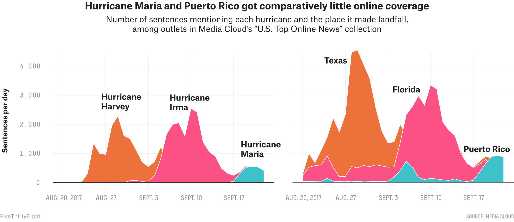
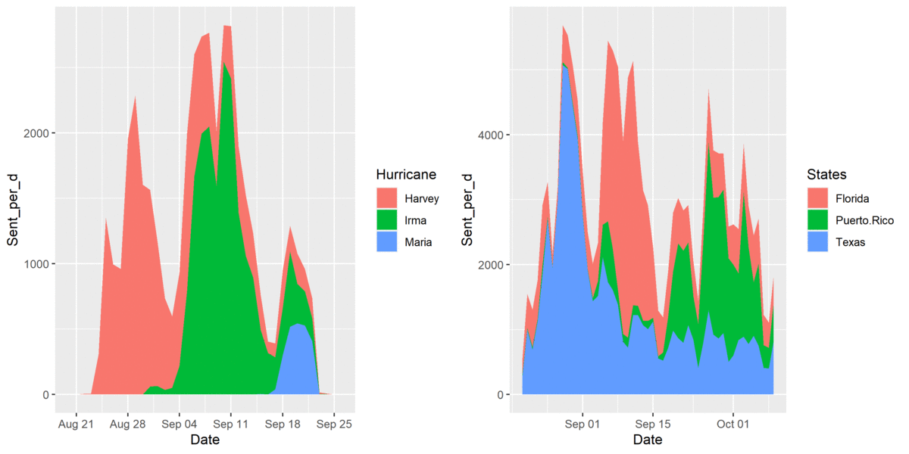
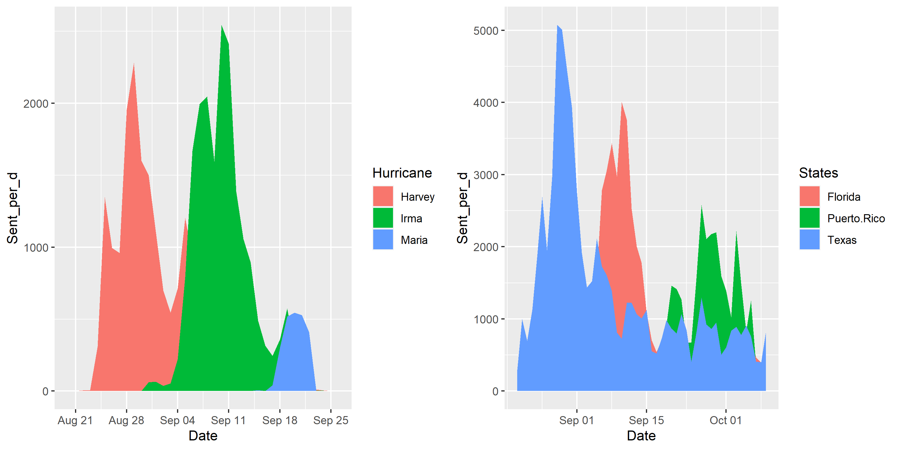
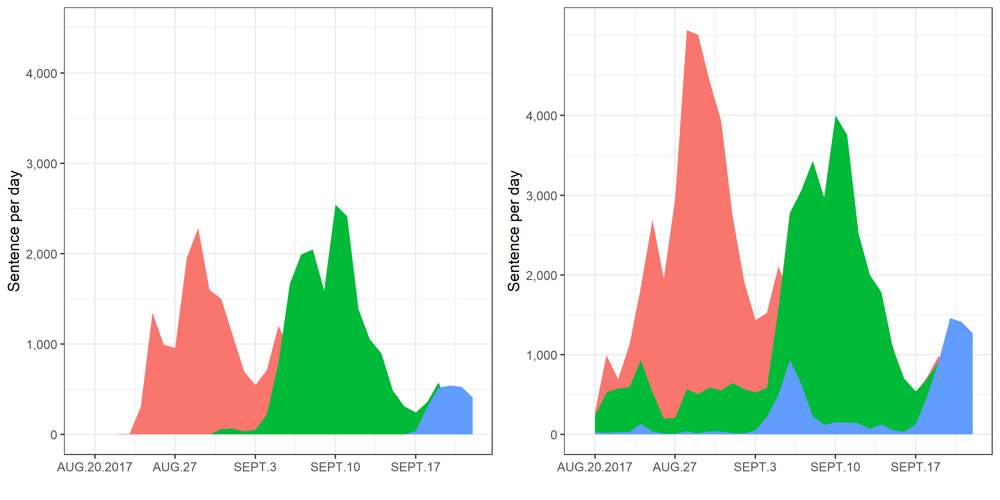
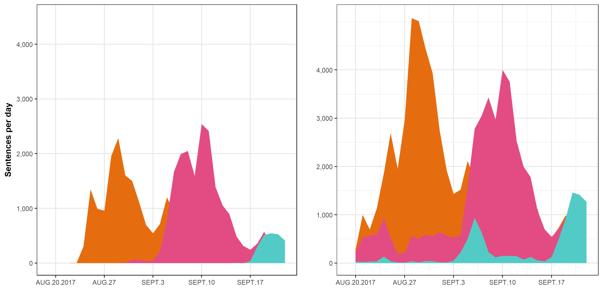
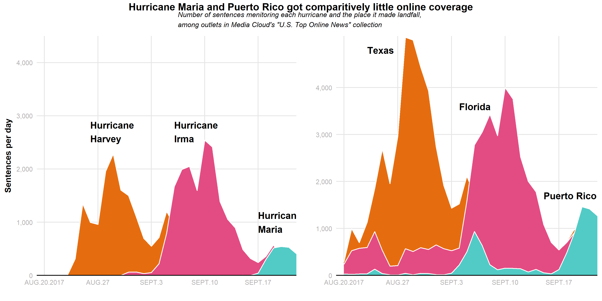

For Module 5 exercise, I am going to re-create a graph published on **FiveThirtyEight**. The original graph can be found in the article titled ["The Media Really Has Neglected Puerto Rico"](https://fivethirtyeight.com/features/the-media-really-has-neglected-puerto-rico/). Data were captured from Media Cloud, which includes number of sentences that mentioned the names of hurricane Harvey, Irma, Maria or Jose on each day from 8/20/2017 to 9/9/2017, and TV news that covered state of Texas, Florida or Puerto Rico were also collected in the same fashion. I also created an animated GIF to show you how the graph was re-created from start to finish!

[Link](https://data.fivethirtyeight.com/) to the dataset

[Link](https://ezgif.com/maker) to the website I used to create the animated GIF file

### Here is the original graph



### Fun animation to show you what I did to replicate the original plot in 5 seconds



## Load packages
```{r, warning = F, message = F}
# load R packages
library(tidyverse) # tidyverse offers great tools for data wrangling and visualization
library(ggpubr) # used to arrange multiple ggplots 
```

## Load raw data
```{r}
# path to data
hurricanes_data_location <- here::here("Module-5-Visualization","data","puerto-rico-media","mediacloud_hurricanes.csv")
states_data_location     <- here::here("Module-5-Visualization","data","puerto-rico-media","mediacloud_states.csv")

# load data. 
hurricanes_data <- read.csv(hurricanes_data_location)
states_data     <- read.csv(states_data_location)
```

Check the data structure and summary of both hurricanes and states data
```{r}
# look up data structure
str(hurricanes_data)
str(states_data)
```

```{r}
# get the data summary
summary(hurricanes_data)
summary(states_data)
```

## Data wrangling
I noticed that R loaded the data and recognized the date variable in both data as character, now I will convert them to date variables to proceed with further plotting.

```{r}
# use as.Date() to convert date from character to date format
hurricanes_data_proccessed <- 
  hurricanes_data %>% 
  mutate(Date = as.Date(Date, format = "%m/%d/%y"))
  
states_data_proccessed <- 
  states_data %>% 
  mutate(Date = as.Date(Date, format = "%m/%d/%y")) %>% 
  #r ename column
  rename("Puerto.Rico" = "X.Puerto.Rico.")

# check data summary again
summary(hurricanes_data)
summary(states_data)
```

Then, I transformed the data format from wide to long using pivot_longer() in tidyr package. Number of columns will be reduced to three, which include Date, Hurricane/State and sentence per day. 

```{r}
# pivot data from wide to long
hurricanes_data_long <- 
  hurricanes_data_proccessed %>% 
  # Hurricane Jose was removed from the graph, so I will do the same
  select(Date, Harvey, Irma, Maria) %>% 
  pivot_longer(
    cols = Harvey:Maria,
    names_to = "Hurricane",
    values_to = "Sent_per_d")

states_data_long <- 
  states_data_proccessed %>% 
  pivot_longer(
    cols = Texas:Florida,
    names_to = "States",
    values_to = "Sent_per_d")

# Check if data were re-structured successfully
View(hurricanes_data_long)
View(states_data_long)
```

## Begin plotting

### First attempt
First, I used geom_area() from ggplot2 package to plot area chart in default setting.

```{r, warning = F}
p1 <- ggplot(hurricanes_data_long, aes(x = Date, y = Sent_per_d, fill = Hurricane)) +
  geom_area()

p2 <- ggplot(states_data_long, aes(x = Date, y = Sent_per_d, fill = States)) +
  geom_area()

# combine plots together
plot.1 <- ggarrange(p1, p2, nrow = 1)

#save figure
figure_file = here::here("Module-5-Visualization","results","plot.1.png")
ggsave(filename = figure_file, plot=plot.1, width = 10, height = 5, dpi = 300) 
```


The stacked area chart was created by default, which looks different from the original graph. I need to create a dodged area chart instead, and to do so I will set the position = "dodge". 

### Create a dodged area chart
```{r, warning = F}
p1 <- ggplot(hurricanes_data_long, aes(x = Date, y = Sent_per_d, fill = Hurricane)) +
  geom_area(position = "dodge")

p2 <- ggplot(states_data_long, aes(x = Date, y = Sent_per_d, fill = States)) +
  geom_area(position = "dodge")

# combine plots together
plot.2 <- ggarrange(p1, p2, nrow = 1)

#save figure
figure_file = here::here("Module-5-Visualization","results","plot.2.png")
ggsave(filename = figure_file, plot=plot.2, width = 10, height = 5, dpi = 300) 
```




## Customize plot appearance
Next, I will make a couple of adjustments to match the appearance of the graph with the published one The following changes will be made:
* Change the order of states variable 
* remove legends
* Change plot theme
* change scales of x-axis and y-axis
* Remove x-axis label
* change the y-axis label

At first, I struggled a bit with the date breaks and labels on the x-axis. I tried to use date_breaks ="1 week" to label the date starting from 08/20/2017 to 09/22/2017 but the plot only only began on 08/21/2017. I think the reason is because there was no data at all on that day. I ended up adding each break and label manually. For more information about position scales for date/time data, you can look up [ggplot2 website](https://ggplot2.tidyverse.org/reference/scale_date.html). 

```{r, warning = F}
p1 <- ggplot(hurricanes_data_long, aes(x = Date, y = Sent_per_d, fill = Hurricane)) +
  geom_area(position = "dodge") +
  # change x-axis range to reflect the dates shown in the original plot
  scale_x_date(breaks = as.Date(c("2017-08-20","2017-08-27","2017-09-03","2017-09-10","2017-09-17")),
               labels = c("AUG.20.2017","AUG.27","SEPT.3","SEPT.10","SEPT.17"),
               limits = as.Date(c("2017-08-19","2017-09-22"))) + 
  # change y-axis scale
  scale_y_continuous(breaks = seq(0,4000,1000),
                     labels = c("0","1,000","2,000","3,000","4,000"),
                     limits = c(0, 4500)) +
  # change to cleaner background 
  theme_bw() +
  # remove lengend
  theme(legend.position = "none") +
  # remove x-axis label
  xlab("") +
  # change y-axis label
  ylab("Sentence per day")
  
# give a specific order for states
states_data_long$States <- factor(states_data_long$States , levels=c("Texas","Florida","Puerto.Rico") )
p2 <- ggplot(states_data_long, aes(x = Date, y = Sent_per_d, fill = States)) +
  geom_area(position = "dodge") +
  # change x-axis range to reflect the dates shown in the original plot
  scale_x_date(breaks = as.Date(c("2017-08-20","2017-08-27","2017-09-03","2017-09-10","2017-09-17")),
               labels = c("AUG.20.2017","AUG.27","SEPT.3","SEPT.10","SEPT.17"),
               limits = as.Date(c("2017-08-19","2017-09-22"))) + 
  # change y-axis scale
  scale_y_continuous(breaks = seq(0,4000,1000),
                     labels = c("0","1,000","2,000","3,000","4,000"),
                     limits = c(0, 5100)) +
  # change to cleaner background 
  theme_bw() +
  # remove legend
  theme(legend.position = "none") +
  # remove x-axis label
  xlab("") +
  # change y-axis label
  ylab("Sentence per day")


# combine plots together
plot.3 <- ggarrange(p1, p2, nrow = 1)

#save figure
figure_file = here::here("Module-5-Visualization","results","plot.3.png")
ggsave(filename = figure_file, plot=plot.3, width = 10, height = 5, dpi = 300) 

```





### Change the color and grid lines of the plot 
I then changed the color of the area by using scale_fill_manual(). I found a website that generates a HTML color code, so you can pick the color you want to customize the plot easily. Here is the [link](https://htmlcolorcodes.com/) to the website. Furthermore, I just want the grid lines on each axis with shown values, and I achieved it by following the instructions on this [website](https://ggplot2.tidyverse.org/reference/theme.html).     

```{r, warning = F}
p1 <- ggplot(hurricanes_data_long, aes(x = Date, y = Sent_per_d, fill = Hurricane)) +
  geom_area(position = "dodge") +
  # change x-axis range to reflect the dates shown in the original plot
  scale_x_date(breaks = as.Date(c("2017-08-20","2017-08-27","2017-09-03","2017-09-10","2017-09-17")),
               labels = c("AUG.20.2017","AUG.27","SEPT.3","SEPT.10","SEPT.17"),
               limits = as.Date(c("2017-08-19","2017-09-22"))) + 
  # change y-axis scale
  scale_y_continuous(breaks = seq(0,4000,1000),
                     labels = c("0","1,000","2,000","3,000","4,000"),
                     limits = c(0, 4500)) +
  # change plot color
  scale_fill_manual(values = c("#E66D0F","#E34C82","#52CBC6")) +
  # remove legend
  theme(legend.position = "none",
        # change panel background 
        panel.background = element_blank(),
        panel.border = element_rect(fill = NA),
        text = element_text(size = 10),
        # only add grid lines on axis with labeled values and choose lighter grey color
        panel.grid.major.x = element_line(color = "grey90"),
        panel.grid.major.y = element_line(color = "grey90")) +
  # remove x-axis label
  xlab("") +
  # change and bold y-axis label
  ylab(expression(bold("Sentences per day")))
  
# give a specific order for states
states_data_long$States <- factor(states_data_long$States , levels=c("Texas","Florida","Puerto.Rico") )
p2 <- ggplot(states_data_long, aes(x = Date, y = Sent_per_d, fill = States)) +
  geom_area(position = "dodge") +
  # change x-axis range to reflect the dates shown in the original plot
  scale_x_date(breaks = as.Date(c("2017-08-20","2017-08-27","2017-09-03","2017-09-10","2017-09-17")),
               labels = c("AUG.20.2017","AUG.27","SEPT.3","SEPT.10","SEPT.17"),
               limits = as.Date(c("2017-08-19","2017-09-22"))) + 
  # change y-axis scale
  scale_y_continuous(breaks = seq(0,4000,1000),
                     labels = c("0","1,000","2,000","3,000","4,000"),
                     limits = c(0, 5100)) +
  # change plot color
  scale_fill_manual(values = c("#E66D0F","#E34C82","#52CBC6")) +
  # change to cleaner background 
  theme_bw() +
  # remove lengend
  theme(legend.position = "none",
        # change panel background 
        panel.background = element_blank(),
        panel.border = element_rect(fill = NA),
        text = element_text(size = 10),
        # only add grid lines on axis with labeled values and choose lighter grey color
        panel.grid.major.x = element_line(color = "grey90"),
        panel.grid.major.y = element_line(color = "grey90")) +
  # remove x-axis label
  xlab("") +
  # remove y-axis label
  ylab("")


# combine plots together
plot.4 <- ggarrange(p1, p2, nrow = 1)

#save figure
figure_file = here::here("Module-5-Visualization","results","plot.4.png")
ggsave(filename = figure_file, plot=plot.4, width = 10, height = 5, dpi = 300) 
```




### Add titles and annotation in the plot
```{r, warning = F}
p1 <- ggplot(hurricanes_data_long, aes(x = Date, y = Sent_per_d, fill = Hurricane)) +
  geom_area(position = "dodge") +
  # change x-axis range to reflect the dates shown in the original plot
  scale_x_date(breaks = as.Date(c("2017-08-20","2017-08-27","2017-09-03","2017-09-10","2017-09-17")),
               labels = c("AUG.20.2017","AUG.27","SEPT.3","SEPT.10","SEPT.17"),
               limits = as.Date(c("2017-08-19","2017-09-22"))) + 
  # change y-axis scale
  scale_y_continuous(breaks = seq(0,4000,1000),
                     labels = c("0","1,000","2,000","3,000","4,000"),
                     limits = c(0, 4500)) +
  # change plot color
  scale_fill_manual(values = c("#E66D0F","#E34C82","#52CBC6")) +
  # remove legend
  theme(legend.position = "none",
        # change panel background 
        panel.background = element_blank(),
        panel.border = element_rect(fill = NA),
        text = element_text(size = 10),
        # only add grid lines on axis with labeled values and choose lighter grey color
        panel.grid.major.x = element_line(color = "grey90"),
        panel.grid.major.y = element_line(color = "grey90"),
        # change the color of axis texts to grey shade) +
        axis.text.x = element_text(colour = "#B2B0B0"),
        axis.text.y = element_text(colour = "#B2B0B0")) +
  # remove x-axis label
  xlab("") +
  # change y-axis label
  ylab(expression(bold("Sentences per day"))) +
  # add annotations 
  annotate("text", x = as.Date("2017-08-26"), y = 2700, 
           label = "Hurricane \nHarvey", 
           size = 4, 
           fontface = "bold",
           color = "black",
           hjust = 0) +
  annotate("text", x = as.Date("2017-09-06"), y = 2700, 
           label = "Hurricane \nIrma", 
           size = 4, 
           fontface = "bold",
           color = "black",
           hjust = 0) +
  annotate("text", x = as.Date("2017-09-18"), y = 1000, 
           label = "Hurricane \nMaria", 
           size = 4, 
           fontface = "bold",
           color = "black",
           hjust = 0) 

  
# give a specific order for states
states_data_long$States <- factor(states_data_long$States , levels=c("Texas","Florida","Puerto.Rico") )
p2 <- ggplot(states_data_long, aes(x = Date, y = Sent_per_d, fill = States)) +
  geom_area(position = "dodge") +
  # change x-axis range to reflect the dates shown in the original plot
  scale_x_date(breaks = as.Date(c("2017-08-20","2017-08-27","2017-09-03","2017-09-10","2017-09-17")),
               labels = c("AUG.20.2017","AUG.27","SEPT.3","SEPT.10","SEPT.17"),
               limits = as.Date(c("2017-08-19","2017-09-22"))) + 
  # change y-axis scale
  scale_y_continuous(breaks = seq(0,4000,1000),
                     labels = c("0","1,000","2,000","3,000","4,000"),
                     limits = c(0, 5100)) +
  # change plot color
  scale_fill_manual(values = c("#E66D0F","#E34C82","#52CBC6")) +
  # remove legend
  theme(legend.position = "none",
        # change panel background 
        panel.background = element_blank(),
        panel.border = element_rect(fill = NA),
        text = element_text(size = 10),
        # only add grid lines on axis with labeled values and choose lighter grey color
        panel.grid.major.x = element_line(color = "grey90"),
        panel.grid.major.y = element_line(color = "grey90"),
        # change the color of axis texts to grey shade) +
        axis.text.x = element_text(colour = "#B2B0B0"),
        axis.text.y = element_text(colour = "#B2B0B0")) +
  # remove x-axis label
  xlab("") +
  # remove y-axis label
  ylab("") +
  # add annotations 
  annotate("text", x = as.Date("2017-08-23"), y = 4800, 
           label = "Texas", 
           size = 4, 
           fontface = "bold",
           color = "black",
           hjust = 0) +
  annotate("text", x = as.Date("2017-09-04"), y = 3600, 
           label = "Florida", 
           size = 4, 
           fontface = "bold",
           color = "black",
           hjust = 0) +
  annotate("text", x = as.Date("2017-09-16"), y = 1700, 
           label = "Puerto Rico", 
           size = 4, 
           fontface = "bold",
           color = "black",
           hjust = 0) 


# combine plots together
plot.5 <- ggarrange(p1, p2, nrow = 1)

# add common title to the combined plot
# first construct plotmath expression, add subtitles as separate lines with smaller font
title <- expression(atop(bold("Hurricane Maria and Puerto Rico got comparitively little online coverage"), 
                         scriptstyle(italic("Number of sentences menitoring each hurricane and the place it made landfall, \namong outlets in Media Cloud's \"U.S. Top Online News\" collection"))))
                         
plot.5.title <- annotate_figure(plot.5,
                          top=text_grob(title))

#save figure
figure_file = here::here("Module-5-Visualization","results","plot.5.png")
ggsave(filename = figure_file, plot=plot.5.title, width = 10, height = 5, dpi = 300)  
```





## The final look of the replicated plot


I think the plot looks very close to the original plot. For some reasons, the states data I downloaded did not match exactly what were presented in the original article. The numbers were a bit off, for instance, the maximum sentences per day in Texas is 5,072, but it looks like it was not higher than 4,500 in the original plot. Another issue that I couldn't resolve is to center the subtitle. I first used plotmath expression to construct the main title and subtitle, and then used annotate_figure to add the texts to the plot, but it defaulted to left alignment, and I couldn't figure out how to alter that. OVerall, this was a fun exercise even though I probably spent too much time figuring out all the little details and tried to make it perfect.